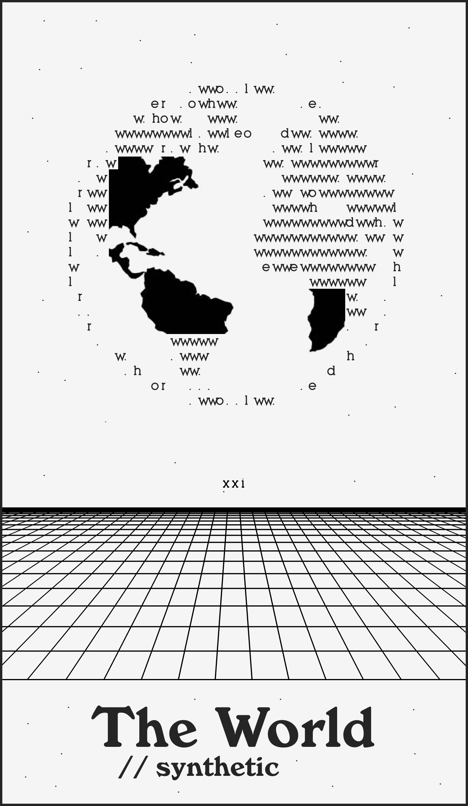

# ASCII World

A tool to generate ASCII SVGs from an image, with the characters "hello, world".

## Description

- Talk about the extractivist (and not generative) logic of AI.
- Talk about how we transform the world to make it readable by machines.
- It uses the first words a human typically exchanges when creating a robot (Hello, World!) as an ASCII characters to represent the world.

## Print

- Will be printed with an axidraw robot.

## Preview

