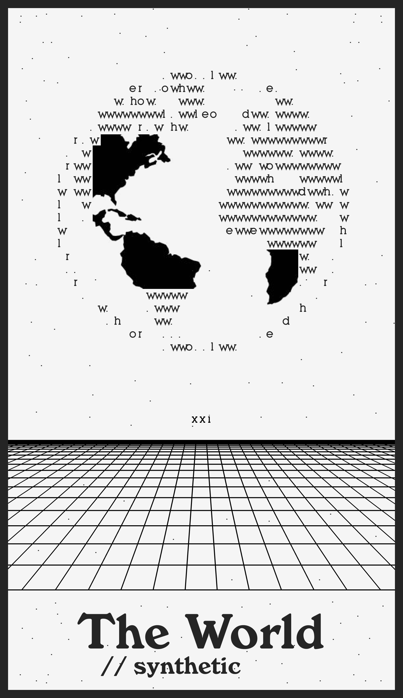

# The Synthetic World

## Introduction

Le monde a-t-il jamais été autre chose qu'une construction ? Une réalité artificielle ? Ou peut-être la question serait-elle de savoir de quel monde il s'agit ?

À la lecture de "[aux sources de l'utopie numérique](../documentation/references/aux%20sources%20de%20l'utopie%20numérique.md)", il est facile de constater que plusieurs mondes existent, ont existé et existeront. Souvent formés en période de guerre, d'utopie, de croyance, de peurs ou de rêves qui s'en sont suivies, ces mondes étaient pour certains des représentation collectives, et possiblement pour d'autres un peu plus individuel. Dans les deux cas, "[la technique est une structure de la perception, elle conditionne la manière dont le réel ou l'être nous apparaît](../documentation/observations/le%20monde%20est%20une%20perception%20technique.md)" (Vial, 2017), qu'il s'agisse de techno-mysticisme, notamment au travers d'expérience interactive qui "[ressemble quelque peu à une expérience psychédélique](../documentation/observations/expérience%20interactive%20psychédélique.md)" (Turner, 2014) , d'organisme cybernétiques, web, écriture, ...

Introduire les 4 ou + mondes que je propose d'élaborer, sur la base de mes références théoriques, qui donneront lieu à la carte

Parler de la carte Tarot, de cycle

## Un monde "dataset"

---

Le jeu de tarot "HEXGEN 2.0" de Suzane Treister nous a été donné comme base de réflexion pour naviguer dans les différents faits historiques et conceptuels qui ont façonné ce que nous connaissons de nos technologies numérique aujourd'hui, à commencer par le développement de la cybernétique.

Piocher une carte : le monde.

En tirant cette carte, alors que nous utilisions le jeu de tarot "HEXGEN 2.0" de Suzane Treister comme support de discussion et d'apprentissage du développement de cybernétique et de l'histoire d'internet,

Peut-être par peur du chaos qu'il représente, ne sommes-nous pas progressivement en train de déléguer notre capacité à le comprendre, l'interpréter et ainsi le fabriquer à une série d'artifice technique qui - depuis l'invention de l'écriture, semble augmenter notre potentialité de délégation à des artifices auxiliaire

Ils risquent de déléguer leurs facultés mémorielles aux supports artificiels, de réciter mécaniquement des savoirs sans en saisir le sens et de cesser d’entraîner leur propres capacités.

Ou est-il, depuis l'invention du langage et plus spécifiquement de l'écriture, un support artificiel

---

# The Card

## Description

- Talk about the extractivist (and not generative) logic of AI.
- Talk about how we transform the world to make it readable by machines.
- It uses the first words a human typically exchanges when creating a robot (Hello, World!) as an ASCII characters to represent the world.
- It represents the end or completion of a cycle, in this case, the cycle of the digitalization of the world.
- The two slashes add put "synthetic" as comment, and evoke the two wands held by the woman on the original card.
- The grid represents the standardization of the world, of ways of thinking, of know-how, of knowledge...
- The title typography is that of the Whole Earth Catalog.
- ASCII characters also refer to the concept of artificial memory (or more broadly, artificialized know-how).

## Print

- Could be printed with an axidraw robot.

## Preview

